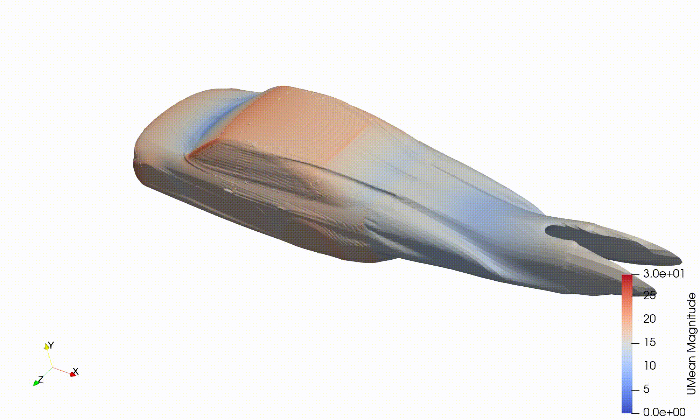

# DrivAer Adjoint Shape Optimization

Adjoint-based shape optimization of the DrivAer reference vehicle using OpenFOAM v2406.


## Overview

This case performs aerodynamic shape optimization of the DrivAer geometry using adjoint methods. The optimization aims to minimize drag with modifying the rear and of the fastback shape.

**OpenFOAM Version:** v2406

## Geometry

The DrivAer geometry files (STL) are not included in this repository due to file size constraints.

**Download geometry:** [Geometry LINK](https://syncandshare.lrz.de/getlink/fi6nZYMkVJGKKAJGwekyH4/)

Place the downloaded STL files in:
```
constant/triSurface/
```

## Case Setup
```bash
# Generate mesh
./preProcessing.sh
```
NOTE: if preProcessing.sh is not executable, you can modify it using the following command:

```bash
# Make preProcessing.sh executable
chmod +x preProcessing.sh
```
```bash
# Run optimization
decomposePar
mpirun -np <number_of_CPU_cores> adjointOptimisationFoam -parallel | tee log.txt
```

## Utility Scripts

The `scripts/` folder contains Python utilities for case setup and post-processing:

### 1. Generate XYZ Points
```bash
python scripts/genXYZ.py
```
Generates XYZ coordinate files for probe locations or sampling points.

NOTE: .xyz file can be directly used for DAfoam

### 2. Convert XYZ file to be compatible with adjointOptimisationFoam
```bash
python scripts/xyz_to_openfoam.py scripts/boxcpsBsplines0.xyz
```
Results a file boxcpsBsplines0, which has to be copied to /constant/controlPoints.org

```bash
cp scripts/boxcpsBsplines0 constant/controlPoints.org/boxcpsBsplines0
```
NOTE: During the simulation the data in controlPoints folder is used. This is created while executing ./preProcessing.sh, therefore it's highly recommended to create the points in system/controlPoints.org before executing the preProcessor. 

### 3. Convert XYZ to .vts format for visualization
```bash
python scripts/convert_XYZ_to_VTK.py
```
Generates .vts format, which can be opened in paraview and visualized using Point Gaussian representation mode.

### 4. Scale stl from mm to meter
```bash
python scripts/scale_stl.py
```
NOTE: You have to modify the input and output file name in the script. Also scaling value can be modified.

### 5. Visualize control point motion

The control points for every timestep are written under ./optimisation/controlPoints

The following script creates a .vtk file, which allows to import the time dependent control point locations as one case to paraview.

```bash
cp scripts/csv_to_vtk_converter.py optimisation/controlPoints/csv_to_vtk_converter.py

python optimisation/controlPoints/csv_to_vtk_converter.py
```
NOTE: The file has to be copied to the same directory, where the .csv data are located

## Results

Results are stored in time directories. Key outputs:
- `postProcessing/` - Force coefficients and field data
- Adjoint sensitivity fields in time directories



## References

- DrivAer Reference Model: [TU Munich](https://www.epc.ed.tum.de/en/aer/research-groups/automotive/drivaer/)
- OpenFOAM Documentation: [www.openfoam.com](https://www.openfoam.com/documentation/files/adjointOptimisationFoamManual_v2312.pdf)

